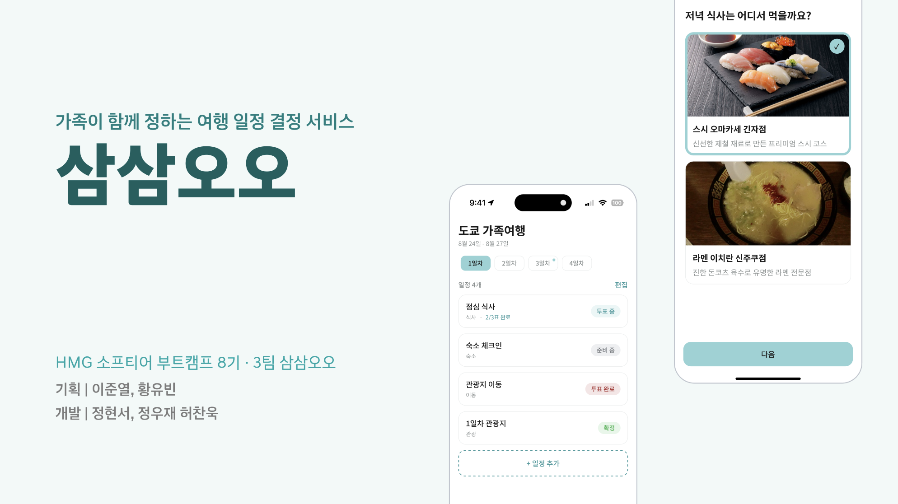
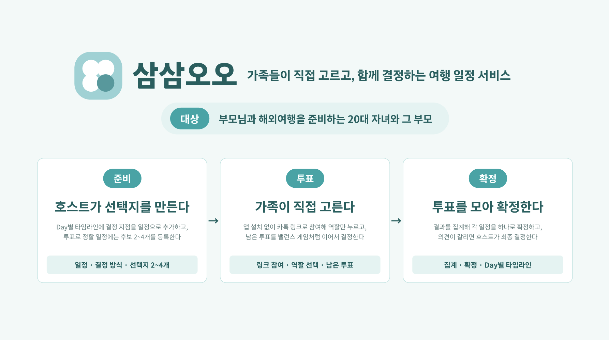
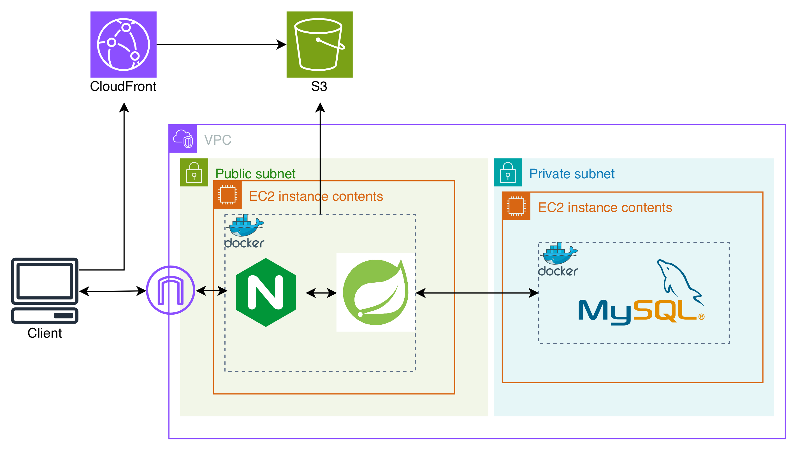
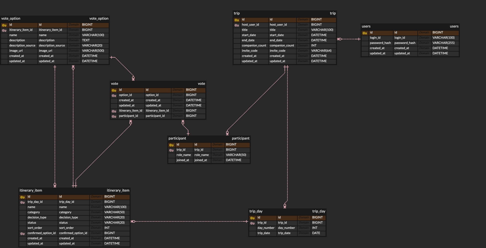

# 삼삼오오

> 부모님과 자녀가 함께 여행 일정을 정하는 서비스

---

## 서비스 설명

부모님과 함께 떠나는 여행. 하지만 자녀가 모든 결정을 혼자서 하기에 부담을 느낍니다

삼삼오오는 자녀가 일정 후보(선택지)를 준비하면 부모님이 밸런스 게임처럼 골라서, 여행 일정을 "함께 결정"하는 서비스입니다.

**주요 기능**

| 기능 | 설명 |
|---|---|
| 여행 만들기 | 여행 이름·기간·동행 가족을 정해 여행을 만들고, 초대 링크로 가족을 초대합니다 |
| 일정 후보 준비 | 하루하루 일정마다 여러 선택지를 만들고, 사진과 설명을 붙입니다 |
| 결정 방식 선택 | 일정마다 부모님 투표로 정할지, 자녀가 직접 결정할지 고를 수 있습니다 |
| 로그인 없는 부모님 참여 | 초대 링크만으로 들어와 회원가입 없이 밸런스 게임처럼 투표합니다 |
| 함께의 결정 확정 | 투표 결과나 자녀의 결정으로 일정을 확정하고, 확정된 여행 일정을 한눈에 모아봅니다 |

---

## Tech Stack

| 구분 | 사용 기술 |
|:---:|---|
| **Backend** |     |
| **Frontend** |       |
| **Database** |  |
| **Infrastructure & CI/CD** |       |

---

## 서비스 아키텍처

---

## ERD

---

## Known Issues

**로그인 없는 참여자(부모님)의 재식별 한계**

부모님은 회원가입 없이 초대 링크로 들어와 세션과 복구용 쿠키로만 식별됩니다. 브라우저 쿠키를 지우거나 다른 기기로 들어오면 이미 투표한 이력을 확인할 수 없습니다. 기기 고유 식별자 등으로 보완하는 방법을 검토했지만, 기간을 고려하여 로그인 없는 접근성을 우선하기로 하고 이번 범위에서는 현재 방식을 유지하기로 했습니다.

**선택지 설명 자동 생성(AI) 미구현**

선택지 설명을 AI가 자동으로 채워주는 기능을 계획했으나, 핵심 기능들을 구현 및 버그를 잡는 시간으로 인해 기간 내 구현하지 못했습니다.

---

## 개발자 조 구성원 정보

소프티어 부트캠프 8기 해커톤 · SAMSAM55 (2026. 08. 24 ~ 2026. 08. 26)

| 역할 | 이름 | GitHub |
|:---:|:---:|:---:|
| 기획 | 이준열 | [@GatsLee](https://github.com/GatsLee) |
| 기획 | 황유빈 | [@alice0047](https://github.com/alice0047) |
| 개발 | 정우재 | [@Woojae-Jeong](https://github.com/Woojae-Jeong) |
| 개발 | 정현서 | [@dlsnfl0615](https://github.com/dlsnfl0615) |
| 개발 | 허찬욱 | [@Heee-oh](https://github.com/Heee-oh) |
